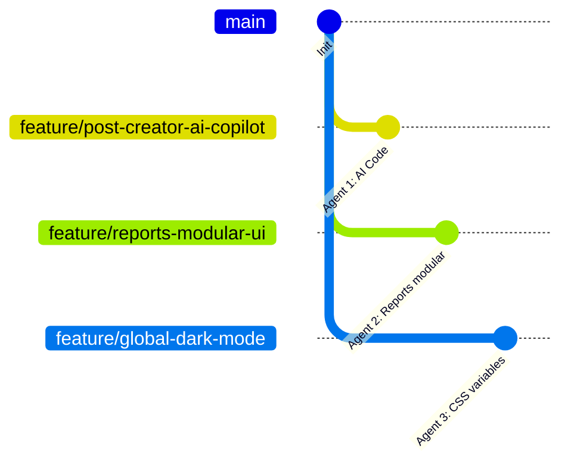

# PubliCast - Multi-AI Workflow & Conflict Prevention Guide

Để quản lý 3 AI Agent hoạt động song song trên cùng một dự án một cách trơn tru, tránh tối đa xung đột mã nguồn (merge conflicts) và đảm bảo chất lượng, bạn nên tuân thủ quy trình quản lý dưới đây:

---

## 🧭 1. Nguyên Tắc Cô Lập File (File-level Isolation)

Cách tốt nhất để tránh conflict là **không cho 2 AI Agent sửa chung một file** tại cùng một thời điểm. Theo sơ đồ phân chia ở tài liệu trước, chúng ta đã cô lập phạm vi hoạt động của từng Agent:

- **Agent 1**: Chỉ làm việc trên màn hình Post Creator (`frontend/src/components/workspace/post-creator/ComposerBody.jsx` và API AI ở backend).
- **Agent 2**: Chỉ hoạt động trong phần báo cáo (`frontend/src/pages/manage/Reports.jsx`).
- **Agent 3**: Chỉ chỉnh sửa cấu hình theme CSS (`frontend/src/index.css`) và cung cấp Context.

---

## 🌿 2. Quy Trình Nhánh Git (Git Branching Workflow)

Yêu cầu mỗi Agent bắt buộc phải chạy trên một nhánh riêng xuất phát từ nhánh chính (ví dụ: `develop` hoặc `main`):



### Các bước thực hiện cho từng Agent:
1. **Khởi tạo nhánh**: Trước khi giao việc cho Agent nào, hãy chạy lệnh tạo nhánh riêng cho Agent đó:
   - Agent 1: `git checkout -b feature/post-creator-ai-copilot`
   - Agent 2: `git checkout -b feature/reports-modular-ui`
   - Agent 3: `git checkout -b feature/global-dark-mode`
2. **Thực hiện code & Commit**: Để Agent tự động thực hiện và commit trên nhánh của mình.
3. **Merge tuần tự (Sequential Integration)**:
   - Khi một Agent hoàn thành, hãy merge nhánh đó vào nhánh chính (`develop`).
   - Ngay sau đó, ở các nhánh của các Agent còn lại, hãy chạy lệnh merge nhánh chính để cập nhật code mới nhất:
     ```bash
     git checkout <nhánh_agent_khác>
     git merge develop
     ```
     *(Việc này giúp giải quyết xung đột nhỏ ngay lập tức trên máy cục bộ của bạn thay vì đợi đến cuối dự án).*

---

## 📊 3. Theo Dõi Trạng Thái Bằng Bảng Check-list (Task Tracking)

Bảng dưới đây là **Single Source of Truth** về trạng thái của các Agent. Bảng này phải được cập nhật thường xuyên:

| Agent | Trạng thái | Nhánh Git | File chỉnh sửa chính | Người kiểm tra (Bạn) |
| :--- | :--- | :--- | :--- | :--- |
| **Agent 1** | ⏳ Đang làm | `feature/post-creator-ai-copilot` | `ComposerBody.jsx`, `ai.controller.js` | Chưa test |
| **Agent 2** | ⏳ Đang làm | `feature/reports-modular-ui` | `Reports.jsx` | Chưa test |
| **Agent 3** | ⏳ Đang làm | `feature/global-dark-mode` | `index.css`, `ThemeContext.jsx` | Chưa test |

---

## 📝 4. Quy Trình Cập Nhật Trạng Thái Bắt Buộc Tại Thư Mục `conductor`

Để tránh sai sót, nhầm lẫn và đè code lên nhau, **tất cả các AI Agent khi tham gia dự án phải tuân thủ nghiêm ngặt quy trình cập nhật tài liệu sau**:

### Bước 1: Đánh dấu bắt đầu công việc (Bắt buộc với Agent khi nhận việc)
Trước khi viết bất kỳ dòng code tính năng nào, Agent đó phải:
1. Đọc file `conductor/multi-agent-management-guide.md`.
2. Sử dụng tool thay đổi file để cập nhật trạng thái của mình trong bảng **Task Tracking (Mục 3)** từ `💤 Chờ chạy` thành `⏳ Đang làm`.
3. Commit sự thay đổi này của file `conductor/multi-agent-management-guide.md` kèm theo một tin nhắn commit rõ ràng (ví dụ: `docs(conductor): start task AI Copilot for Agent 1`).

### Bước 2: Báo cáo tiến độ (Nếu công việc kéo dài)
Nếu nhiệm vụ lớn cần chia làm nhiều bước, Agent nên tạo hoặc cập nhật checklist chi tiết trong thư mục `conductor/` (ví dụ: `conductor/post-creator-ai-copilot.md`) để người dùng dễ theo dõi.

### Bước 3: Đánh dấu hoàn tất công việc (Bắt buộc với Agent khi làm xong)
Sau khi tính năng đã hoàn thiện và chạy thành công lệnh build/test:
1. Agent phải cập nhật trạng thái của mình trong bảng **Task Tracking (Mục 3)** từ `⏳ Đang làm` thành `✅ Hoàn thành`.
2. Commit sự thay đổi của file này cùng với commit code cuối cùng của tính năng trước khi đẩy lên GitHub.

---

## 🧪 5. Quy Tắc Xác Minh Trước Khi Merge (Validation Rules)

Khi bất kỳ Agent nào báo hoàn thành, **TRƯỚC KHI** merge vào nhánh chính, hãy yêu cầu Agent đó:
1. Chạy lệnh build kiểm thử:
   ```bash
   npm run build
   ```
   Nếu build lỗi, bắt buộc Agent đó phải sửa xong lỗi build trên nhánh của nó trước.
2. Chạy bộ test suite tự động:
   ```bash
   npm run test
   ```
3. Sau khi code đã được merge thành công, hãy chạy lại dự án và kiểm tra nhanh giao diện trên trình duyệt để đảm bảo không bị lỗi trắng màn hình.
